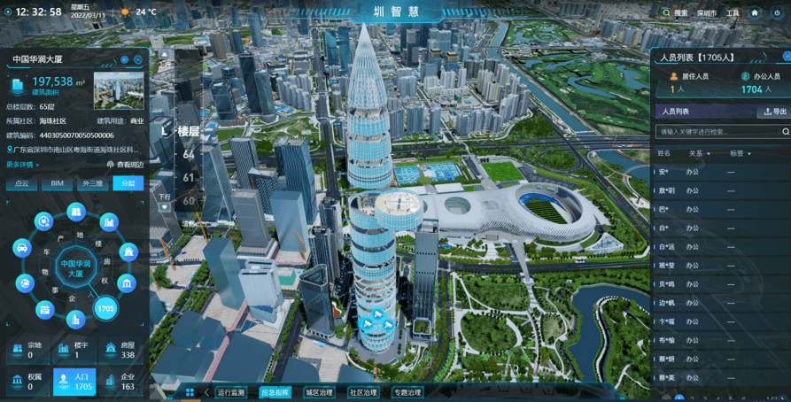
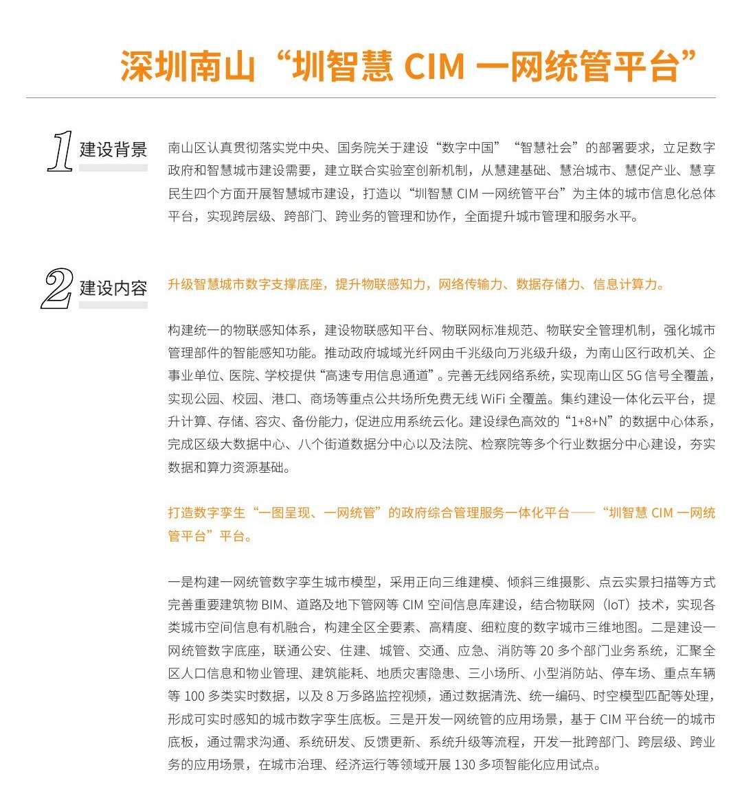
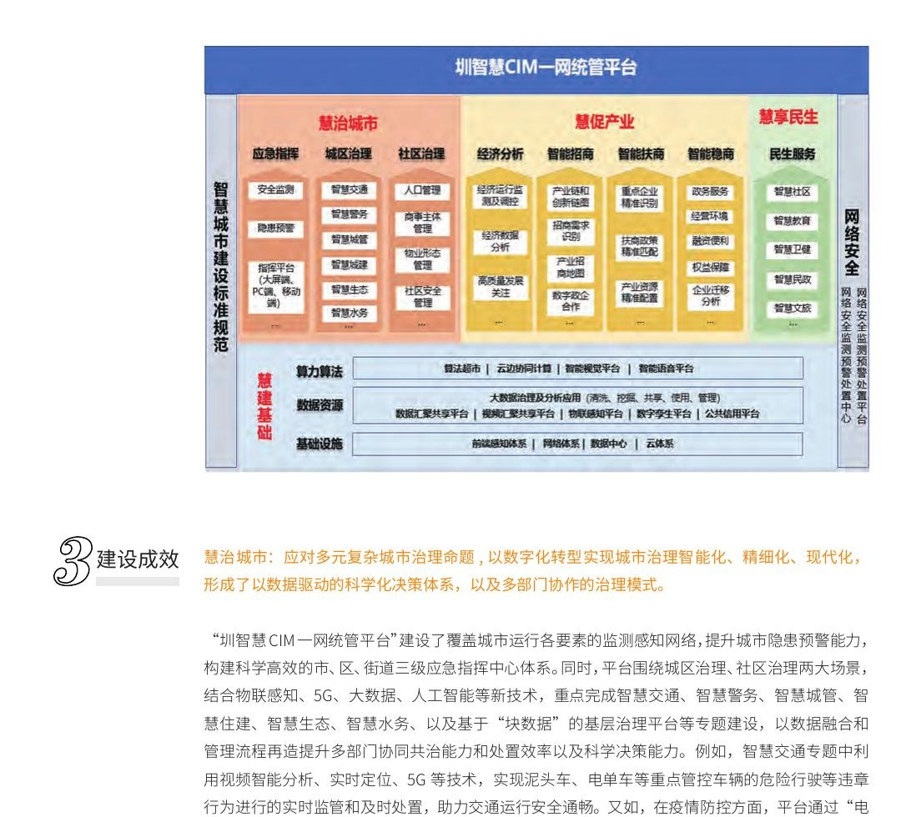
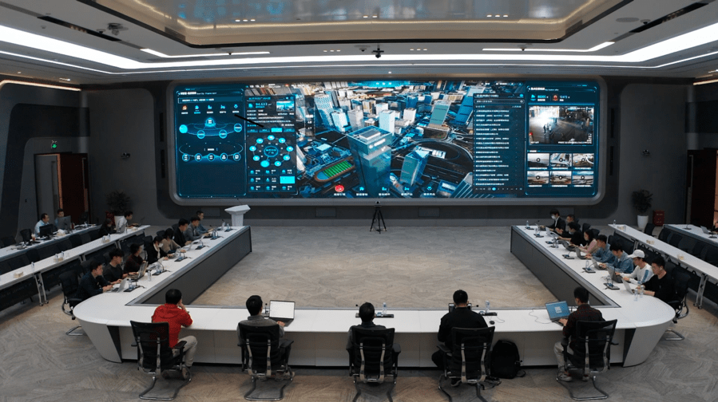
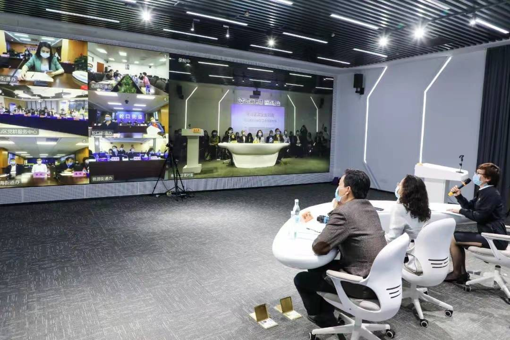
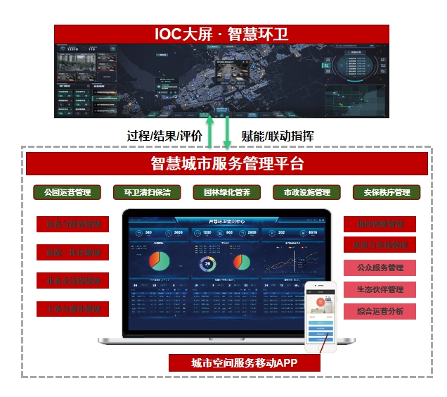
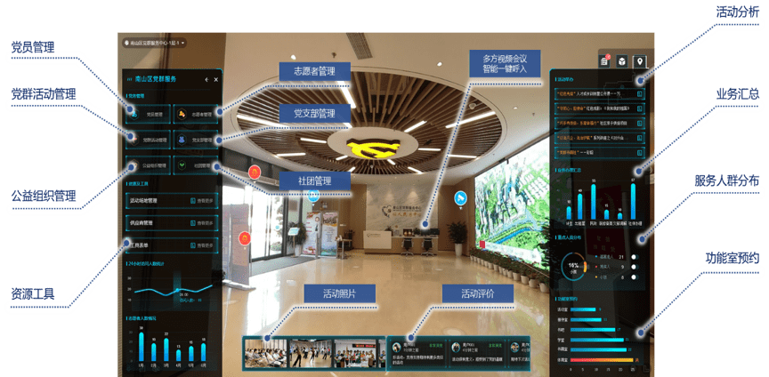

# 一、项目概况

本案例的现行、证据最稳定名称为**深圳南山“圳智慧”CIM一网统管平台**。用户给出的“深圳市南山区圳智慧平台系统”可作为检索口径和别名，但尚未在公开政府采购公告中核验为一个单一项目的完整正式采购名称。2019年政府材料称其为“‘圳智慧’服务平台”，2022年南山区政府工作报告将“圳智慧”定义为“南山区政府治理一网统管平台”，近年的区政数局年度总结则稳定使用“‘圳智慧’CIM一网统管平台”。这些名称反映的是同一智慧城市品牌和核心平台的演进，并不意味着存在一个覆盖全部子系统、一次性采购完成的“大总包”。〔S01〕〔S02〕〔S03〕

平台覆盖广东省深圳市南山区全域，由南山区数字政府主管部门统筹建设和持续迭代。早期主管部门公开名称包括“南山区数字政府建设管理局（政务服务局）”“南山区政务服务数据管理局”，现为“南山区政务服务和数据管理局”。公开案例材料显示，南山区通过联合创新实验室汇聚平安、电信、中兴、商汤、武大吉奥等多家企业能力；但现有材料不足以把任何一家企业认定为整个“圳智慧”平台唯一总承建单位。〔S04〕〔S05〕

平台并非一次建成。2018年材料已出现“圳智慧”企业服务版等试点；2019年“圳智慧”服务平台作为联合创新成果公开；中国电信案例材料称2019年启动南山全域三维建模、2020年启动精细化加工、2021年4月完成“圳智慧·云上城市应用服务平台”；2022年后政府文件进一步以CIM和一网统管为核心重构平台，2024—2026年仍在扩充数字孪生数据、优化性能并孵化新场景。〔S01〕〔S04〕〔S06〕〔S07〕

公开资料未披露核心平台统一立项金额、总合同金额和最终验收时间。南山区另有“圳智慧·智慧交通管理服务应用平台”“圳智慧·智能稳商管理服务平台”“圳智慧·南山区智慧消防建设项目”等独立采购，它们有各自项目编号、供应商和合同金额，不能相加后冒充本平台总投资。〔S08〕

# 二、建设背景与核心问题

南山区既是高密度建成区，也是产业、人口和城市运行要素高度集聚区。平台建设的现实问题不是抽象的“数据孤岛”，而是多类治理对象没有共同的空间坐标和协同流程：楼栋、房屋、权属、人口、法人、地下管线、道路、视频和物联设备分别沉淀在不同业务系统中；同一事件可能横跨公安、住建、城管、交通、应急、消防、街道和社区，单一部门能看到局部信息，却难以完成跨部门研判和处置。区级决策还需要把宏观经济指标、企业经营、人口分布和城市空间关联起来，传统报表难以回答“问题具体发生在哪里、影响哪些对象、应由谁处置”。〔S03〕〔S06〕〔S09〕

南山区采用“联合创新实验室”机制，把部门需求、企业方案和场景试点连接起来。其公开机制是“应用需求政府提、技术方案企业出、业务场景选点试、实验成效专家估、成果落地项目上、智慧城市大家建”。这解释了“圳智慧”为何长期表现为一个持续孵化的城市级能力体系，而非固定版本的软件产品。〔S04〕〔S05〕

另一个直接问题是空间数据的颗粒度不足。普通二维地图只能表示位置，无法把建筑楼层、房屋、人口、法人及地下空间对象建立细粒度关联。南山区作为BIM/CIM试点区，逐步建设建筑、道路、管线、室内全景和街景模型，并通过时空模型匹配把业务数据挂接到数字孪生底板上，以支撑从“看城区”向“查对象、找责任、调资源、追过程”转变。〔S03〕〔S06〕

# 三、建设目标与实施范围

平台目标可概括为：以全区统一数字孪生底板承载城市运行对象和业务数据，为区级部门提供运行态势监测、辅助决策、统一指挥调度和事件分拨处置能力，形成“一图全面感知、一键可知全局、一体运行联动”。〔S02〕

《数字政府和智慧南山建设“十四五”规划》将总体逻辑归纳为“慧建基础、慧治城市、慧促产业、慧享民生”：先建设CIM、BIM、GIS、物联、视频、数据和算力等共性能力，再围绕城市治理、产业服务和民生服务孵化应用。公开案例集还把其架构概括为城市治理、产业发展、民生服务三类应用与统一慧建基础。〔S05〕〔S09〕

空间范围为南山区全域，管理对象覆盖地、楼、房、权、人、事、物等城市实体；业务范围则随年度项目和场景持续扩展。需特别说明，平台不是南山区所有数字政府系统的同义词：面向群众的“南山通”、面向企业的“i南山”、政府运行“一网协同”中屏、政务微信小屏均有独立定位；“圳智慧”主要对应大屏端CIM一网统管与其场景体系。独立采购的智慧交通、智慧消防、智能稳商、智慧社区等系统是否与核心平台形成何种接口，应分别按合同和验收资料核验。〔S03〕〔S08〕

# 四、总体方案与建设内容

## 4.1 建设逻辑与平台架构

总体方案不是单纯建一块可视化大屏，而是按“基础设施—数据资源—算法能力—业务应用—用户接入”组织。公开案例架构显示，底部包括感知、网络、数据中心和云体系；数据资源层包含数据、视频、物联、数字孪生和公共信用等平台；能力算法层提供算法超市、云边协同计算、智能视觉和智能语音能力；上层面向应急指挥、城区治理、社区治理、经济分析、招商扶商稳商和民生服务等业务。用户可通过指挥中心大屏、电脑端、移动端等方式接入。〔S05〕

## 4.2 数字孪生底座与数据体系

2022年公开材料显示，平台采用正向BIM建模、倾斜摄影和点云实景扫描等方式完善重要建筑、道路及地下管网模型；通过数据清洗、统一编码和时空模型匹配，把人口、物业、建筑能耗、地质灾害隐患、三小场所、停车场、重点车辆等实时或专题数据关联到空间对象。同期媒体转述受访单位数据称，平台导入3000多栋建筑、9000多万平方米BIM模型，对接30个业务系统，汇聚132类、9000多万条数据。该组数据具有明确来源，但属于2022年时点成果，不能视为当前实时规模。〔S05〕〔S10〕

到2024年，区政数局披露新增完成房建类BIM建模172万平方米、道路BIM建模20公里、城市部件精细模型40平方公里、室内全景250万平方米、道路VR街景1865公里、地下管线光纤管道建模726.58公里；同期物联网感知平台接入59类、52526端设备，视频平台汇聚12万余路监控。这里的数字是当年工作总结所述建设成果，且“新增/完成”与历年累计模型口径并不完全一致，不宜直接求和。〔S03〕

## 4.3 平台边界和接口关系

已证实的关系包括：平台打通公安、住建、城管、交通等多个部门业务系统；疫情场景与基层网格管理系统联动；后海分中心以“圳智慧·后海分中心平台”为空间载体；规划提出关联不动产登记、人口、法人、社会和经济等信息。〔S06〕〔S09〕〔S11〕

尚不能确认的内容包括：各独立子项目采用何种API、消息总线或数据库同步方式；数据更新频率；微服务、容器和国产化部署细节；统一身份认证和权限模型的具体实现；各算法精度及验收指标。公开材料提及平安DataMax、中国电信云上城市等技术能力，但这些厂商材料只能证明其参与或产品支撑，不能据此认定核心平台全部底层由单一产品构成。〔S07〕〔S12〕

# 五、核心业务场景与运行闭环

## 5.1 城市对象“一图关联”与楼栋画像

工作人员从CIM地图选择建筑，可查看楼层、房屋、人口、法人、物业、权属等关联信息，并按业务标签下钻。其价值不是展示三维模型本身，而是把不同部门掌握的对象数据汇聚到统一空间实体，便于研判某一楼栋或片区的人、企、房关系。公开界面证实了楼栋、BIM、分层及关联对象查询能力；具体数据权限和更新周期尚未公开。〔S10〕

## 5.2 城市运行事件发现与协同处置

政府工作报告明确平台提供态势监测、统一指挥调度和事件分拨处置；官方案例集描述其实现城市运行监测、预警预报、指挥决策和快速处置。结合公开流程，可确认平台目标闭环为“感知/发现—预警研判—任务分拨—部门或街道处置—结果反馈”。但现有公开资料没有披露统一工单字段、处置时限、超时督办规则和跨系统状态同步机制，因此不能把所有专题都写成已经达到同等闭环成熟度。〔S02〕〔S05〕

## 5.3 区—街道—社区远程会商

平台建设了区级指挥中心，并推动街道、社区层级协同。公开活动照片显示区级会场与多个街道、社区通过视频进行联动，说明平台运行不仅依赖大屏数据，还需要组织体系和会商机制配合。该照片能够证明远程协同场景存在，但不能单独证明某次会议属于系统验收或应急实战。〔S10〕

## 5.4 经济运行分析与企业服务

2022年公开报道披露，平台经济运行调度模块围绕10大行业、41项核算指标及上千细分指标开展GDP测算和指标归因；产业链分析汇聚20余条产业链信息、60余万家企业和2000余产品/技术环节。智能惠商场景建立政策标签库和标准数据池，将企业数据与申报条件比对，推动“企业找政策”向“政策找企业”转变。相关数字来自区政数局受访材料，属于实施方/建设方披露，尚缺独立审计或验收报告交叉验证。〔S10〕

需要严格区分：后续“圳智慧·智能稳商管理服务平台”是独立采购项目，包含稳商驾驶舱、PC端、移动端、接口及数据治理，并有独立合同和履约评价。它可复用或接入“圳智慧”体系，但其3795.3万元合同金额不能作为CIM一网统管平台总投资。〔S08〕

## 5.5 后海片区智慧运营

后海中心区以3.5平方公里为试点，由南山区政府与华润置地组建合署运营团队，以后海智慧运营中心和“圳智慧·后海分中心平台”为载体，探索“一个阵地、一个平台、一支队伍”。政府报道确认平台展示工程建设进度，并落地信用停车、低空无人机配送、低空智能巡检等试点。该模式的核心是把线上平台、线下运营队伍和公共空间管理机制结合起来，属于区级平台向片区运营下沉的证据。〔S11〕

2024—2025年工作计划进一步提出，以后海为样板，将大数据、AI和数字孪生结合，实现事件预警、推送、分拨和处置全流程自动化。此处属于计划口径，不能提前写成全面建成成效。〔S03〕

## 5.6 基层党群服务关联场景

公开报道将“党群G+”描述为南山区政数局推动的区、街道、社区三级党群资源融合共享应用。现有能力图展示党员、组织、志愿者、社团、活动和服务人群等管理维度，但公开资料尚不足以确认这些模块与CIM核心平台采用何种接口、是否共用统一工单或是否全部纳入“一网统管”验收，因此仅作为相关专题能力说明。〔S10〕

# 六、实施成效、难点与经验

## 6.1 有公开证据支持的成效

第一，形成了持续更新的区级数字孪生底板，并把建筑、道路、地下管线、室内全景、街景、物联和视频等多类资源纳入统一建设体系。第二，平台已成为多部门专题应用的共性支撑，2022年官方案例集称其支撑十多个委办局130多项专题应用；2024年区政数局仍在围绕规划、城市更新、公园、马拉松、消防和街道等场景深化应用。第三，平台从区级总览向后海、街道、社区等层级下沉，说明其组织形态不止“领导驾驶舱”，而是尝试嵌入片区运营和基层治理。〔S03〕〔S05〕〔S11〕

## 6.2 建设方披露但尚未独立核验的成效

公开报道中的模型、人口法人、业务系统和数据条数，以及经济分析、企业服务等指标，主要来自区政数局或受访单位供稿。它们可信度高于普通厂商宣传，但由于缺少同口径验收报告、审计材料或开放数据接口，仍应作为“建设方披露的阶段成果”使用，避免跨年度累加或推导ROI。〔S10〕

## 6.3 难点与限制

平台最大难点首先是数据持续更新，而不是一次性建模。建筑、房屋、人口、法人和设施状态变化频繁，若缺少责任部门、编码规则和更新机制，再精细的三维底板也会迅速失真。区政数局2025年计划明确提出摸索三维数据长效更新机制，反向证明这一问题仍在持续解决。〔S03〕〔S13〕

其次是平台边界治理。“圳智慧”既是区级品牌，又被用于多个独立采购项目命名，容易造成建设范围和投资重复计算。可复制的做法是把区级CIM底座、共性能力、专题系统和片区分中心分层管理，明确每个项目的数据责任、接口责任、验收边界和运维主体。

第三是“可观”向“可管”的转化。三维可视化能够提升态势理解，但只有事件进入工单、责任部门接单、过程可追溯、结果可反馈、绩效可评价，才形成治理闭环。公开资料证明部分场景具备分拨处置目标和流程，但尚不足以确认130多项专题都达到同样成熟度。

第四是多供应商集成与长期运维。联合创新实验室有利于快速引入能力，却也带来标准、接口、知识产权、数据安全和供应商锁定风险。南山经验中真正可复制的是“政府提需求—企业出方案—场景试点—专家评估—成熟后立项”的孵化机制，而不是简单复制某家厂商产品。〔S04〕〔S05〕

# 七、研究结论与参考来源

“圳智慧”真正有价值的地方，不是做出一幅精美的南山三维地图，而是把区级数字孪生底板、跨部门业务数据、物联视频感知、指挥中心和场景孵化机制组织成持续运营的治理基础设施。它与普通可视化平台的区别，在于公开材料能够证明其进入了楼栋对象关联、跨部门专题、事件分拨、经济研判和片区运营等真实工作环节。

最值得复制的能力有三项：一是以统一空间对象编码把地、楼、房、权、人、企、事、物关联起来；二是用共性底座支撑专题系统，而非每个部门重复建设一套地图和数据底座；三是把平台建设与联合创新实验室、区—街—社区协同以及片区合署运营结合，解决“系统有人建、场景无人运营”的问题。

现有公开信息仍有明显缺口：核心平台各期采购项目和合同关系、统一总投资、详细数据标准、接口清单、部署架构、数据更新责任、算法验收指标、工单闭环规则、当前活跃用户和实际使用频率均未充分披露。因此，本案例适合作为高可信候选资产导入，但在正式发布前仍建议由人工复核项目名称、地图点位、图片授权和独立采购边界。

主要来源：〔S01〕〔S02〕〔S03〕〔S04〕〔S05〕〔S06〕〔S09〕〔S10〕〔S11〕〔S13〕。完整来源与核验说明见 `sources/source.md`。
