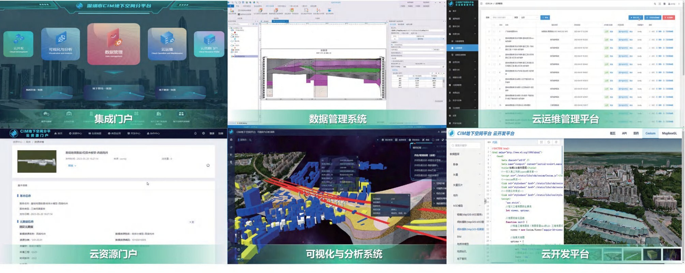
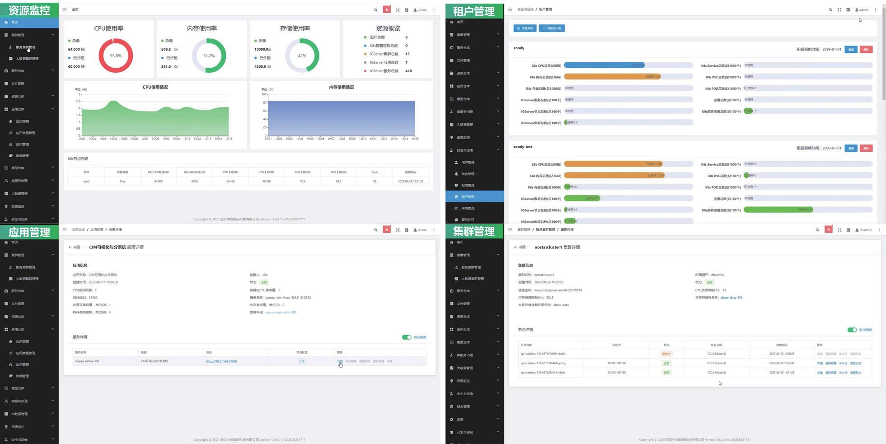
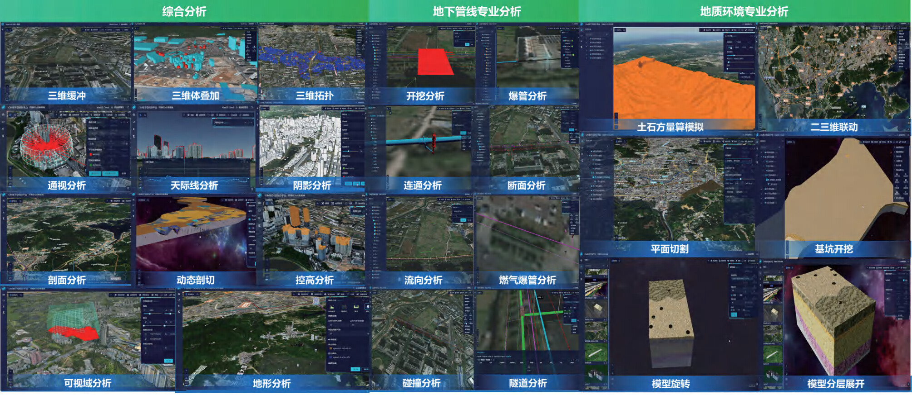
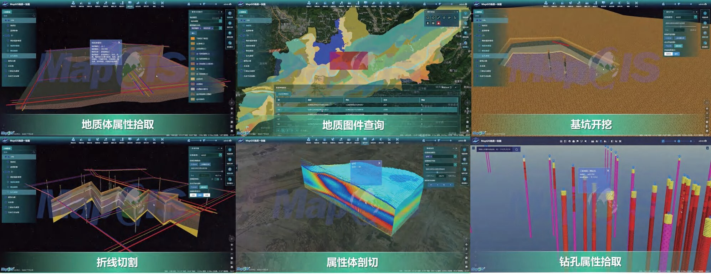
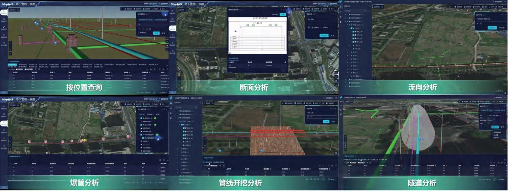
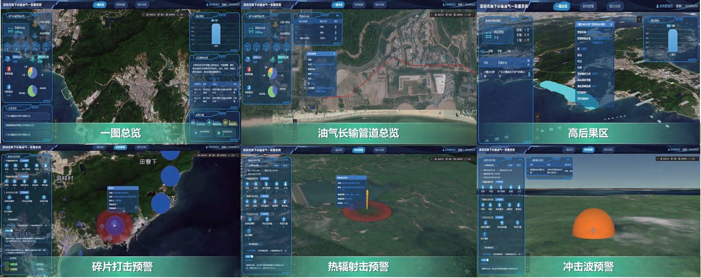
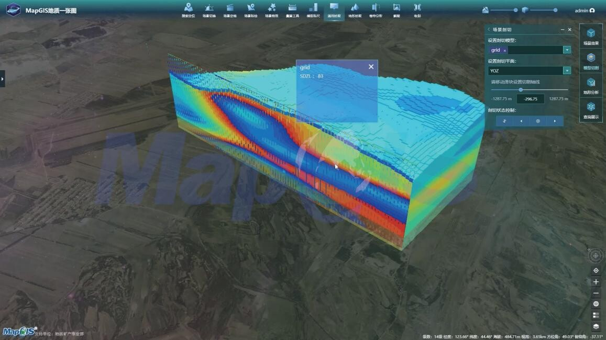

# 深圳市全市域CIM地下空间平台建设及应用

## 一、项目概况

深圳市CIM地下空间平台是深圳市全市域时空信息平台（以下简称"CIM平台"）的地下空间专项组成部分，定位为深圳地下空间的统一数字底座。该平台由深圳市大数据资源管理中心作为采购人统筹管理，深圳市城市公共安全技术研究院有限公司（以下简称"深圳城安院"，深圳市国资委直管国企）负责运营实施，武汉中地数码科技有限公司（以下简称"中地数码"）提供底层GIS平台技术支撑，三方协作推进。〔S03〕〔S08〕

平台的核心使命是解决超大型城市地下空间"底数不清、隐蔽性强、可知不可见"的治理难题。在全国大多数城市以"地上CIM可视化"为主要建设方向的背景下，深圳率先开展了系统性的地下空间CIM建设。平台综合应用"GIS+BIM+IoT"技术，汇聚城市供排水、燃气、电力、通信、长输油气等地下管线数据，以及地质钻孔数据、地下隧道模型、地铁、地下综合体等地下设施数据，形成"地下空间一张图"，并在此基础上开展长输油气管道保护智能监管、城镇燃气管道保护智能监管、数字化勘察、建设工程三阶段安全风险管控、道路占道开挖综合管控等多类场景应用。〔S04〕

公开资料可确认，深圳城安院与中地数码于2022年10月签署战略合作协议，2023年发布《基于信创环境的CIM平台解决方案》，同年11月以"城安中地队"的名义参加深圳市人民政府主办的"先锋杯"数字孪生创新应用大赛，作品《基于国产化GIS的深圳市CIM地下空间平台研究及探索》获得地下空间专题技术与创新应用赛道一等奖。现有公开材料不足以把合作签约时间直接等同于平台正式立项或开工时间。〔S05〕〔S09〕

2026年4月，CIM平台地上地下空间运维服务项目完成政府采购，中标单位为深圳市易图资讯股份有限公司（联合体成员含深圳城安院），中标金额245万元/年，合同一年一签，最长不超过36个月。这说明至2026年，平台已进入稳定运维阶段。〔S08〕

在技术路线上，平台最显著的特征是全栈信创适配：基于中地数码自主研发的MapGIS跨平台GIS内核，适配国产鲲鹏920 CPU、麒麟V10操作系统、崖山数据库（与深圳计算科学研究院联合攻关）以及国产BIM软件，构建"覆盖多端、稳定高效、安全可信"的CIM地下空间平台。〔S03〕〔S12〕

平台覆盖范围为深圳市行政辖区，但具体的地下空间数据汇集程度和应用场景覆盖度在公开资料中未披露详尽的量化指标。

>深圳市CIM地下空间分平台主界面截图。界面展示集成门户、数据管理、云运维、可视化分析、云开发等核心模块入口，背景为深圳城市三维模型。来源：中地数码官方产品文档/S12。

## 二、为什么建设

### 原有业务模式

要理解深圳市为什么要专门建设CIM地下空间平台，需要先回到深圳地下空间管理的原有业务状态。

深圳作为改革开放窗口城市，经过四十余年的高速发展，地下空间开发强度位居全国前列。截至平台启动建设阶段（约2022—2023年），深圳地下空间已经形成了高度复杂的立体网络：地铁运营里程超过500公里，数十条地下隧道纵横交错；供排水、燃气、电力、通信等各类管线总长度超过十万公里，分别由不同权属单位（如深圳燃气集团、南方电网深圳供电局、各通信运营商、水务集团等）独立建设和维护；多条油气长输管道穿越城市人口密集区；大量地下综合体、地下交通枢纽仍在不断施工中。

在原有管理模式下，这些地下设施的信息化管理主要呈现以下特征：

第一，**数据分散在各部门，各自为战。** 地下管线的数据掌握在各权属单位手中，地质数据归规划和自然资源部门，施工信息归住建部门，燃气管线安全归应急管理部门，市政管网归城管和水务部门。各系统数据格式不同、坐标体系不同、更新节奏不同，没有统一的三维空间坐标框架来整合它们。在二维地图时代，这些问题尚可勉强容忍——各单位的管线数据至少还能在各自系统内管理；但一旦需要理解地下设施之间的空间关系（比如某条燃气管线与正在施工的地铁隧道之间有多远），二维系统就无法有效回答。

第二，**地下空间"可知不可见"，决策缺乏直观支撑。** 深圳城安院在案例材料中明确指出，地下空间的"隐蔽性强"是其治理难点之首。〔S04〕传统的管线数据以数据库表格和二维线状要素形式存在，工程管理人员看到的是一个CAD文件或GIS图层上的一条线，但无法直观判断这条管线埋在地下几米深、管径多大、材质是什么、与上方地面建筑是什么关系、与旁边的另一条管线是否冲突。尤其在施工场景下，一个道路改造项目涉及开挖审批时，审批人员需要同时了解该区域地下的全部管线分布、周边地质条件、附近施工活动等多维信息，但原来只能依赖纸质报告或人工协调各方提供资料，效率极低且容易遗漏。

第三，**工程安全监管缺乏统一工具。** 深圳地下空间开发强度大，地铁、隧道、管廊等重大工程频繁施工，施工过程对周边地质环境、既有管线和建筑会产生扰动。在平台建成之前，安全监管主要依赖建设单位自行报送、主管部门抽查的方式。这种方式既无法做到实时感知，也无法对施工全过程的风险变化进行量化追踪。例如盾构法隧道施工是深圳地下工程的主要工法之一，盾构机在地下掘进时，前方地质条件变化、推进速度、土仓压力等参数实时变化，如果这些信息不能汇聚到一个统一平台进行空间化分析，监管部门就只能依赖事后报告，而丧失了在风险发生前进行预警的能力。

### 真实痛点

上述问题不是抽象的管理效率问题，而是会带来真实的安全风险、财政成本和协同摩擦。

从安全风险角度，最大的隐患在于地下工程施工对周边管线和地质的扰动。深圳近年来多次发生地下施工导致管线损坏的事故，轻则影响居民供水供气，重则引发燃气泄漏、地面塌陷等次生灾害。在长输油气管道方面，深圳有多条高压油气管线穿越城市建成区，这些管线的"高后果区"——即一旦发生泄漏或爆炸可能造成重大人员伤亡的区域——涉及大量人口密集场所。如果无法在三维空间中同时看到管道位置和周边建筑、人口、地质等信息，就无法准确评估事故后果，更无法做好应急预案。〔S04〕

从协同成本角度，道路占道开挖是城市管理的典型协同难题。一个道路施工项目可能同时涉及供水管线改迁、燃气保护、电力迁改、通信保护、交通安全等多个部门。原来每个部门各有自己的系统和审批流程，缺乏在统一三维场景中联合审查的能力，导致反复开挖、互相牵制的情况时有发生。〔S04〕

从财政成本角度，由于数据分散、底数不清，同一区域的地下空间往往被重复勘察，工程项目之间无法共享勘察数据，造成大量资源浪费。同时，由于缺乏统一的风险评估工具，保险机构也难以准确评估地下工程的真实风险水平，使得风险定价和融资安排缺乏科学依据。

### 为什么需要这个平台

CIM地上平台（全市域时空信息平台）从2020年12月开始试运行，到2023年已经为32家单位提供应用支撑，但当时主要聚焦地上空间——实景三维模型、BIM建筑模型、地面设施管理等。〔S14〕地上空间的信息可以通过航拍、倾斜摄影等方式快速感知和采集，但地下空间完全不同：地下设施不可见，必须依赖历史建设档案、权属单位数据、地质勘察记录等间接信息。这意味着地下CIM的数据来源更复杂、标准更难统一、数据质量更难保证。

因此，地下空间CIM不能作为地上CIM的一个简单图层叠加来处理。它需要从数据汇交制度（解决数据从哪里来）、标准规范（解决数据如何统一）、平台功能（解决数据如何管理展示）、应用系统（解决数据如何用）等多个维度单独设计和建设。这就是为什么深圳要在CIM整体框架之下，专门建设地下空间分平台，而不是仅仅在地上CIM平台上"增加一个地下图层"。〔S04〕

此外还有一个重要的战略考量：信息安全和自主可控。城市地下空间数据涉及国家安全和城市基础设施安全，如果底层GIS平台依赖国外软件，存在不可控的数据安全和断供风险。深圳选择基于国产化MapGIS平台和信创技术栈，是从根本上解决这个问题。〔S03〕

## 三、如何建设

CIM地下空间平台的设计逻辑，可以用"制度标准→数据汇聚→平台承载→场景应用"四个层次来理解。但需要注意的是，这四个层次并非简单的上下叠加，而是同步推进、相互约束的。如果先建平台再找数据，平台就会变成空架子；如果先汇数据再建平台，数据的标准化和接口设计就会缺失统一的约束。深圳的做法是先建立制度标准（解决"数据怎么来"），再建设平台（解决"数据怎么管、怎么用"），同时在建设中根据场景需求倒推数据标准。〔S04〕

### 第一层：制度标准先行——解决"数据从哪来"

平台建设的第一步不是写代码，而是建立地下空间数据汇交的工作机制和标准规范。这包括三件事：

第一件是明确数据汇交的责任主体和工作规则。深圳将地下管线数据和地质数据的汇交责任单位细化到各权属单位和相关部门，建立数据汇交制度，压实各方主体责任。也就是说，不是让平台自己去采集数据，而是让掌握数据的单位按照统一标准定期汇交。〔S04〕

第二件是新建地方标准。深圳新建了地下管线数据标准和地质数据库规范两个地方标准，统一了各权属单位的数据汇交格式。这个工作的重要性怎么强调都不过分——因为深圳地下管线的权属单位众多（供水、排水、燃气、电力、通信、油气管线等），各单位使用的设计软件、数据格式、坐标系统可能完全不同，没有统一标准就无法实现数据互通。在2023年《数字孪生先锋城市建设行动计划》中，也明确要求编制地下管线数据标准、地质数据库规范等地方标准。〔S06〕〔S12〕

第三件是明确数据在规划、建设、竣工验收等各环节的监督机制和汇交要求。特别是新建管线，要求在竣工验收阶段就完成数据汇交，从源头上控制数据质量。对于存量管线，则通过补测、补绘、普查等方式逐步完善。〔S04〕

### 第二层：数据汇聚——形成"地下空间一张图"

在制度和标准框架建立之后，平台开始大规模汇聚地下空间数据。汇聚的数据类型包括：

- **地下管线数据**：供排水、燃气、电力、通信、长输油气等各类管线的平面位置、埋深、管径、材质等属性信息；
- **地质钻孔数据**：全市域的地质钻孔记录，包括地层结构、岩性、地下水位等信息。基于这些数据开展地质三维建模，形成地下地质体的三维模型；
- **地下设施BIM模型**：地铁、地下隧道、地下管廊、地下综合体等大型地下设施的精细化建筑信息模型；
- **物联感知数据**：安装在管线、工地、地质监测点上的各类传感器实时数据。

这些数据汇聚后，经过标准化处理、坐标配准、质量检测后，形成统一的地下空间数据底板。平台称之为"地下空间一张图"，即在统一时空基准下，将多源异构的地下空间数据融合成一张可查询、可分析、可展示的三维底图。〔S04〕

### 第三层：平台承载——基于MapGIS跨平台内核的五大子系统

CIM地下空间平台基于中地数码自主研发的MapGIS跨平台GIS内核构建，总体分为四层架构：基础设施层、数据管理层、平台服务层和应用层。〔S07〕

基础设施层运行在鹏城云脑（深圳市政务云计算基础设施）之上，采用全栈信创适配：国产鲲鹏920 CPU、麒麟V10操作系统、崖山数据库。这是全国城市CIM平台中较早全面适配信创技术的案例。〔S03〕〔S12〕

平台服务层基于MapGIS跨平台内核搭建五大子系统：

**（1）地下空间数据管理系统。** 这是平台的数据引擎，负责多源异构GIS数据库的管理，支持TB级海量数据存储，提供坐标转换、模型轻量化、三维配准、数据质检等200余种工具，同时具备规则建模、地质智能建模、高精度地质网格剖分（精度达到10亿级）等能力。〔S12〕

**（2）地下空间可视化与分析系统。** 这是面向用户的核心界面。系统将全空间数据（矢量、影像、BIM、IoT、地质模型等）统一管理，提供二维/三维/非空间/视频/轨迹等多维视图，支持四维时空模拟（建设过程对比、漫游、仿真）和专业分析功能（GIS空间分析、地质分析、可视性分析、爆管分析、基坑开挖模拟等）。〔S12〕

**（3）地下空间云运维管理平台。** 基于云原生GIS技术体系和微服务架构，支持容器化部署、弹性伸缩和多租户协同。"多租户"机制是平台设计的关键特征——它使得行业用户（如燃气公司、水务集团）和区级用户可以在同一套平台上拥有各自独立的工作空间，"分级管理、分别维护"，既节省建设成本，又保证数据隔离和权限控制。〔S04〕〔S12〕

**（4）地下空间云资源门户。** 提供统一的资源入口和访问管理。

**（5）地下空间云开发平台。** 为上层应用开发提供开放的接口和开发环境，支持行业用户基于平台数据底座开发定制化应用。〔S12〕

### 第四层：场景应用——从底层数据到业务价值

平台建设的最终目的是支撑具体业务场景。深圳选取了五个最具代表性的地下空间风险场景进行示范应用：长输油气管道保护智能监管、城镇燃气管线保护智能监管、建设工程三阶段安全风险管控、道路占道开挖综合管控、数字化勘察。这些场景的共同特征是都涉及地下空间的三维可视化、多源数据分析和业务协同，且直接关系到城市安全。〔S04〕

>平台运维监控界面，展示资源监控、租户管理、应用管理、集群管理等功能模块，包含CPU/内存/存储使用率统计。来源：中地数码官方产品文档/S12。

>综合分析、地下管线专业分析、地质环境专业分析工具集界面，包含多种空间分析工具。来源：中地数码官方产品文档/S12。

>全空间数据一体化融合展示界面，支持三维/多视窗、时空对比、地下空间漫游等功能。来源：中地数码官方产品文档/S12。

>地质建模与分析功能界面，包含地质属性查询、基坑开挖模拟、隧道分析、地下空间分析等功能。来源：中地数码官方产品文档/S12。

### 数据从哪里来，如何流动

CIM地下空间平台的数据来源可以按数据类别逐一追溯。与地上CIM平台可以通过航拍和倾斜摄影大范围采集数据不同，地下空间数据几乎完全依赖已有档案和各方汇交，这是地下CIM建设中最大的挑战之一。

### 各类数据的来源与汇交方式

**地下管线数据。** 这是平台数据底板的核心组成部分。深圳地下管线的权属单位包括深圳燃气集团、南方电网深圳供电局、深圳水务集团、三大通信运营商、各长输油气管线运营企业（如西气东输、珠三角成品油管道等的运营公司）等。这些单位各自掌握自己建设和维护的管线数据。平台不是自己去采集管线数据，而是通过深圳市建立的数据汇交制度，要求各权属单位按照新建的地方标准（统一数据格式、坐标系统、属性规范）定期汇交。〔S04〕汇交的数据包括管线的平面位置、埋深、管径、材质、建设年代、连接节点等。

>地下管线一张图产品功能界面，展示空间查询、断面分析、爆管分析和管线开挖分析等能力。该图来自MapGIS官方产品文档，用于证明产品能力，不单独证明这些功能均已在深圳完成验收。来源：S12。

在数据汇交的监督机制上，平台要求新建管线在竣工验收阶段必须完成数据汇交，"覆土测绘"是关键环节——即在管线覆土之前进行精确测量，从源头保证数据质量。对于存量管线，则通过补测、补绘、普查等方式逐步完善。深圳还建立了数据汇交的"黑名单机制"，对不履行汇交义务的单位进行约束。〔S04〕

**地质钻孔数据。** 深圳全市域已经积累了大量地质钻孔记录，这些钻孔数据主要来源于历年的工程勘察项目、地质调查项目等。平台汇聚这些钻孔数据后，进行地质三维建模，将钻孔点数据转化为连续的地下地质体三维模型，包括各地层的空间分布、岩性特征、地下水位等。这些模型对于理解地下工程可能遇到的地质条件、评估施工风险至关重要。〔S04〕〔S12〕

**地下设施BIM模型。** 这是最精细化的数据层。深圳选取了大量已建和在建地下设施的BIM模型导入平台，包括地铁隧道模型、地下管廊模型、大型地下综合体模型等。这些BIM模型经过轻量化处理（去除冗余细节、优化网格拓扑）后接入平台，与管线数据和地质模型在统一空间坐标系下叠加展示。〔S04〕〔S12〕

>平台数据管理总览界面，展示地下空间多源数据接入与融合后的三维场景效果，包含管线、地质模型、地下设施等要素叠加。来源：中地数码官方产品文档/S12。

**物联感知数据。** 平台接入了部署在地下管线、在建工地、地质监测点上的各类传感器数据。这些数据来自不同的物联感知终端，包括管道压力传感器、燃气泄漏探测器、地层沉降监测仪、地下水位监测计等。物联数据的接入使平台从静态的数据展示升级为动态的实时态势感知——管线内压力突然变化、某个区域地面沉降速率异常，都可以在平台第一时间被发现。〔S04〕

**在建工地数据。** 这是用于风险耦合分析的关键数据源。平台接入全市在建工地的信息，包括工地位置、施工类型、施工阶段、影响范围等，与地下管线和地质数据进行空间叠加，识别出"在燃气管线附近正在进行深基坑开挖"这类交叉风险点。〔S04〕

### 数据如何进入应用

数据从汇聚到最终在业务场景中发挥作用，经历以下流程：

原始数据由各权属单位按标准汇交 → 平台进行数据质检（格式检查、空间一致性检查、属性完整性检查） → 标准化处理（坐标统一、格式转换、属性映射） → 进入平台数据管理系统存储 → 在可视化与分析系统中与其他数据融合展示 → 业务人员在场景中查询、分析、决策。

值得注意的是，CIM地下空间平台并不是一个封闭的系统。它采用"多租户"架构，各行业用户可以在平台上拥有自己的工作空间，既能使用平台共享的数据底座，也能在授权范围内管理自己的专题数据。同时，平台通过云开发平台向第三方开发者开放接口，支持行业用户基于平台开发定制化应用。〔S04〕〔S12〕

## 四、核心场景与业务闭环

以下选取四个最具代表性的场景展开说明。每个场景均按照"原来有什么问题 → 系统做了什么 → 谁在用、怎么用 → 最终改变了什么"的逻辑展开。

### 场景一：长输油气管道保护智能监管

**原来的问题。** 深圳有多条高压油气长输管道穿越城市建成区，部分管道途经人口密集区域，形成所谓的"高后果区"。这些管道一旦被第三方施工破坏，后果不堪设想。但原来，管道运营企业掌握着管线位置和运行数据，城市规划部门掌握着地面建设规划，国土部门掌握着地质数据，应急部门掌握着应急预案——各方信息分散在各自系统中，没有任何一个平台能同时看到管道位置、周边建筑、人口分布、地质条件和在建工程的完整画面。结果就是，管道事故后果"看不清"，周边风险"想不到"，应急救援缺乏科学依据。〔S04〕

**系统做了什么。** 平台首先对长输油气管道及其途经的"高后果区"地上下环境进行二三维建模，将管道在三维空间中的精确位置、埋深、走向可视化。然后，接入管道沿线前端感知监测设备的实时数据（如管道压力、温度、周边土壤浓度等），实现风险实时研判。更关键的是，平台集成了基于灾害链的定量分析模型——一旦发生管道泄漏或爆炸，系统可以模拟计算热辐射影响范围、冲击波扩散范围、碎片打击范围等，结合三维空间中的人口密度和建筑分布数据，定量评估事故后果。〔S04〕〔S12〕

平台同时接入周边地质数据、在建工地数据和物联感知数据，对管道沿线的风险进行动态评估。例如，如果管道附近有一个正在开挖的工地，平台可以自动识别并预警施工活动对管道的潜在威胁；如果某一区段的管道压力异常，平台可以结合周边人口密度计算风险等级，并自动推送应急处置信息。〔S04〕

**谁在用，怎么用。** 使用主体包括管道运营企业（日常巡检和风险管控）、应急管理部门（应急预案制定和事故响应）、规划和住建部门（规划审批时核查与管道的安全距离）。各方在平台上看到的是同一张三维地图，但各自可以看到与自己业务相关的数据图层和分析结果。

**最终改变了什么。** 解决了周边风险"看不清"（从二维线条到三维空间关系的可视化升级）、风险后果"想不到"（从定性判断到定量分析的能力升级）、救援"不科学"（从经验驱动到数据驱动的决策升级）三个核心问题。〔S04〕

>深圳长输油气管线一张图界面。展示深圳高后果区油气长输管道的三维可视化监控，包含一图总览、高后果区、碎片打击/热辐射/冲击波预警等多维分析。来源：中地数码官方产品文档/S12。

>平台应用场景页面：集成门户、数据管理、云运维、可视化分析、云开发等核心模块。来源：中地数码官方产品文档/S12。

### 场景二：建设工程三阶段安全风险管控

**原来的问题。** 深圳地下施工频繁——地铁新线建设、道路隧道开挖、综合管廊施工等工程不断。这些地下工程施工过程中，盾构机掘进产生的振动和地层扰动可能对周边管线、建筑和地质环境造成影响。但在平台建成之前，安全监管主要依赖建设单位定期报送资料、主管部门不定期抽查，既无法做到实时感知，也无法对施工全过程（施工前→施工中→施工后）的风险变化进行量化追踪。一旦工程完工移交，后续阶段的风险监测往往断裂。〔S04〕

**系统做了什么。** 平台协同深圳市建设工程智能监管平台，构建了覆盖施工前、施工中、施工后三阶段的风险闭环管控体系。具体而言：施工前阶段，系统对工程所在区域的地下管线、地质条件、周边建筑进行全面分析，进行风险预评估（识别工程可能影响的对象和风险等级）；施工中阶段，接入盾构机实时运行参数（推进速度、土仓压力、注浆量等）和周边监测数据，进行动态风险管控（实时对比实际数据与预设阈值，发现异常及时预警）；施工后阶段，进入持续监测状态，关注施工完成后可能出现的延迟性地质沉降或管线变形。平台将城市级、行业级、项目级的风险信息整合在"一张图"上，实现多层级的透明化风险揭示。〔S04〕〔S12〕

**谁在用，怎么用。** 建设单位（工程实施的安全责任主体）在平台上查看本项目施工对周边环境的影响范围和风险等级；行业主管部门在平台上面板查看全市或本行业所有重大地下工程的风险态势；平台自动对比"施工前预评估→施工中动态监测→施工后持续跟踪"各环节数据，生成风险变化趋势报告。

**最终改变了什么。** 实现了地下工程施工全生命周期的风险追踪——从"出了问题再处置"升级为"事前评估→过程监控→持续跟踪"的全过程管理。同时，以信息化应用要求倒逼行业规范化实施全过程风险管控，强化了建设单位的安全主体责任。〔S04〕

>地下工程风险监控一张图。平台聚焦深圳盾构法隧道工程，构建施工前-中-后三阶段风险闭环管控体系。来源：中地数码官方产品文档/S12。

### 场景三：城镇燃气管线保护智能监管

**原来的问题。** 城镇燃气管线与长输油气管道不同——长输管道由专业公司运营，管理规范度高；城镇燃气管线则分布在城市各个角落，与市政道路、建筑工地、住宅小区的距离极近，日常面临的最大风险是"第三方施工破坏"——道路开挖、桩基施工等地面工程意外挖断燃气管线。这类事故在深圳并不罕见。但原来，燃气管线运营企业知道自己的管线位置，建筑工地归住建部门监管，道路开挖归城管和交通部门审批——三方信息不通，导致燃气管线经常被"不知情"的施工活动威胁。〔S04〕

**系统做了什么。** 平台对城镇燃气管线进行二三维建模，接入全市在建工地数据信息进行空间耦合叠加。也就是说，系统能自动识别"某段燃气管线周围X米范围内有在建工地"，并根据施工类型（深基坑、桩基、爆破等）评估威胁等级。同时结合地下空间平台的数据融合能力，将燃气管线数据与地质数据、周边建筑数据、物联感知数据综合分析，实现跨行业的安全风险研判。〔S04〕

**谁在用，怎么用。** 这是一个典型的"多主体责任协同"场景。城镇燃气管线主管部门（如市住建局城管处）、燃气运营企业（如深圳燃气集团）、建设项目主管部门（如住建局）、以及五方责任主体（建设、勘察、设计、施工、监理）都在平台上进行协同。平台将原来分散在各方的信息汇聚到一起，让各方看到"同一个事实"。

**最终改变了什么。** 打通了原来"管线运营企业不知道附近有什么施工、施工方不知道脚下有什么管线"的信息壁垒，将城镇燃气管线保护从"被动事后抢修"升级为"主动事前协同监管"。〔S04〕

### 场景四：道路占道开挖综合管控

**原来的问题。** 城市道路占道开挖涉及多个部门——交通部门管交通疏导、城管部门管路面恢复、水务部门管供排水管线、燃气公司管燃气管线保护、电力公司管电缆保护、通信运营商管通信管线……原来各部门各自管理、各自审批，导致一条道路反复开挖、各部门信息不通。更危险的是，在开挖过程中如果损坏了某条地下管线（燃气、电缆等），后果严重。〔S04〕

**系统做了什么。** 平台集成了片区地下管线及全部地下要素数据成果，构建三维动态的城市地下管网空间分布图。在此基础上，开发信息提取与核查、线上会签、开挖审批等功能，实现道路占道开挖的全流程管控。具体来说：申请人提出开挖申请后，系统自动叠加开挖区域的地下管线分布，识别可能影响的管线类型和权属单位，自动分发给相关权属单位进行线上会签；各权属单位在同一个三维场景中查看管线位置和保护要求，协同制定管线保护方案。〔S04〕

**谁在用，怎么用。** 道路开挖审批部门、各地下管线权属单位、施工方。各方在统一的三维场景中进行审查和会商，取代了原来各传纸质图、各自出保护方案的低效模式。

**最终改变了什么。** 打通了占道开挖过程中各部门之间的"信息壁垒"，将反复开挖、信息不通的管理困局转化为全流程数据支撑下的综合管控。〔S04〕

## 五、实施与运营

CIM地下空间平台的建设实施主体关系需要从不同阶段分别说明。

**政策主管与统筹层面：** CIM平台整体建设由深圳市政务服务数据管理局和规划和自然资源局牵头，依据2023年深圳市人民政府办公厅印发的《数字孪生先锋城市建设行动计划（2023）》（深府办函〔2023〕42号）推进。CIM地下空间平台是其中"1+11+N"CIM平台体系的重要组成部分。〔S06〕

**采购人层面：** 深圳市大数据资源管理中心是CIM平台的政府采购人。2026年4月完成的"CIM平台地上地下空间运维服务项目"（项目编号：SZDL2026000606）由该中心统一采购，中标供应商为深圳市易图资讯股份有限公司（联合体成员含深圳市城市公共安全技术研究院有限公司），中标金额245万元/年。〔S08〕

**建设与运营核心层面：** 深圳市城市公共安全技术研究院有限公司（深圳城安院）是平台的实际建设和运营核心单位。深圳城安院是深圳市人民政府创新设立、深圳市国资委直管的国有企业，业务涵盖城市公共安全各领域。2022年10月，深圳城安院与中地数码签署战略合作协议，明确合作推动GIS技术在城市安全风险治理、监测预警、应急救援等领域的应用，合作的第一步就是地下空间CIM平台。深圳城安院在地下空间顶层设计方案、政策机制研究、标准规范编制、数据汇交制度建立等方面承担主要职责。〔S03〕〔S09〕

**技术支撑层面：** 武汉中地数码科技有限公司提供底层MapGIS GIS平台技术支撑。中地数码是中国地质大学（武汉）产业化企业，拥有MapGIS自主知识产权，是中国GIS领域规模最大的软件企业之一。深圳城安院与中地数码的合作基于此前已完成的"城市地质项目"，该项目的阶段性成果促使双方将合作扩展到CIM地下空间平台的全面建设。〔S09〕〔S15〕

**战略合作节点：** 2022年10月21日，双方正式签署战略合作协议。签约仪式上，深圳城安院院长董方、中地数码联合创始人刘永教授等出席。董方当时指出："此次从见面到签订战略合作只用了短短一个月的时间。"〔S09〕

### 投资情况

CIM地下空间平台的投资情况需要区分两个层面：

**项目建设投资：** 地下空间平台与CIM地上平台统筹规划建设，按照CIM地上下一体化实施方案同步推进。由于CIM平台总投资额在公开资料中未单独披露地下空间分项的投资数据，该部分具体金额暂无法确认。

**后续运维费用：** 2026年采购的CIM平台地上地下空间运维服务合同，金额为245万元/年，合同期限最长36个月。这是可以确认的最直接的运维费用数据。〔S08〕

### 建设周期

从公开资料可以梳理出以下建设时间线：

- 2022年10月：深圳城安院与中地数码签署战略合作协议，地下空间CIM建设正式启动；〔S09〕
- 2023年5月：双方联合发布《基于信创环境的CIM平台解决方案》；〔S03〕
- 2023年6月：《数字孪生先锋城市建设行动计划(2023)》印发，明确CIM平台总体框架；〔S06〕
- 2023年11月：在"先锋杯"大赛中获奖，标志平台核心框架已建成并通过专业评审；〔S05〕
- 2025年1月：学术期刊发表项目实施论文，标志平台建设应用经验系统化输出；〔S10〕
- 2026年4—5月：CIM平台运维服务项目完成采购，标志进入稳定运维阶段。〔S08〕

## 六、创新与实际成效

对于CIM地下空间平台的建设成效，需要审慎区分三类信息来源。

### 已确认事实（有明确公开证据）

**平台获奖。** 在2023年11月的"先锋杯"数字孪生创新应用大赛中，"城安中地队"凭借《基于国产化GIS的深圳市CIM地下空间平台研究及探索》获得地下空间专题赛道一等奖。该竞赛由深圳市人民政府主办，共611个团队参赛，涵盖来自全球的企业、高校和科研机构。清华大学教授顾明在评审时评价："很多优秀参赛作品都采用了深圳数字孪生城市建设提出的'基于BIM精细化模型的CIM平台建设路线'。"〔S05〕

**学术论文发表。** 《基于国产化GIS的深圳市CIM地下空间平台研究及探索》一文发表于《智能建筑与智慧城市》期刊（2025年01期），论文摘要确认了"推进了深圳市地下'透明化'管理，提升了地下空间风险防控能力"的实施成效。〔S10〕

**第三方权威引用。** 2025年7月，中国城市规划学会常务理事梅耀林等专家在关于韧性城市建设的学术笔谈中，将深圳CIM平台作为典型案例引用："深圳以城市CIM平台建设为抓手，建立地下空间多部门联合工作架构，开发建设工程风险管控、道路开挖管控、城镇燃气管线监管等多场景应用和全流程闭环管理。"这是来自学术共同体的外部认定，非项目参与方自述。〔S11〕

**信创适配完成。** 多个来源交叉确认，平台已完成全流程信创适配：国产鲲鹏920芯片、麒麟V10操作系统、崖山数据库、国产BIM软件，基于MapGIS跨平台GIS内核。〔S03〕〔S07〕〔S12〕

**运维进入稳定阶段。** 2026年CIM平台运维服务项目完成政府采购并公示结果，说明平台已达到可运维状态。〔S08〕

### 实施单位公开声明（尚未独立第三方验证）

**"全国率先"。** 深圳城安院在案例材料中提出深圳"在全国率先开展'全市域、全要素、全周期'地下空间CIM建设和应用"。这一表述缺乏与全国其他城市的系统性对比证据。上海、广州、北京等城市在不同时间段也有地下空间信息化建设的探索，但确实尚无公开资料表明有城市进行过"全市域CIM地下空间"的系统性建设。〔S04〕

**场景应用成效。** 案例材料中提到通过"三维可视化和定量分析模型，定量分析管道事故后果，解决周边风险'看不清'、风险后果'想不到'问题；精准应急救援数字化辅助支撑，解决救援'不科学问题'"。〔S04〕但从公开资料看，具体的量化成效数据（例如风险识别率提升了多少、事故发生率下降了多少、审批效率提高了多少）尚未披露。

### 专业判断（基于项目机制推断）

CIM地下空间平台的价值，不仅体现在平台本身建设完成，更体现在它建立了一套制度化的地下空间数据共享机制。如果这套机制能够有效运转——权属单位按标准汇交数据、数据质量得到持续监督、各部门基于统一平台协同工作——那么它对中国其他城市推进地下空间数字化管理的示范意义，将远超平台软件本身。但这个判断目前仍缺乏运行一定时间后的效果验证数据。

### 建设演进

CIM地下空间平台的建设演进，需要区分"最初建设内容"和"后续新增能力"，避免将不同阶段的内容混为一谈。

**前期合作阶段（2022年10月之前）。** 深圳城安院与中地数码在正式签署CIM战略合作之前，已经合作完成了"城市地质项目"，该项目产出了阶段性成果。院长董方在签约时明确表示"前期合作的城市地质项目已取得了重要阶段性成果"。〔S09〕

**战略合作启动（2022年10月）。** 双方正式签约，明确从地下空间开始切入，推动GIS技术在城市安全风险治理等领域的应用。〔S09〕

**顶层设计与标准建立（2022—2023年）。** 这个阶段的核心工作不是写代码，而是建立地下空间数据汇交制度、新建地方标准。包括编制地下空间CIM数据标准、明确各权属单位的汇交职责、建立数据汇交监督机制等。〔S04〕

**平台核心框架建设与发布（2023年）。** 2023年5月发布《基于信创环境的CIM平台解决方案》〔S03〕，2023年11月在"先锋杯"大赛获奖，标志核心框架已建成。〔S05〕

**试点应用落地（2023—2025年）。** 在核心框架建成后，开始聚焦具体场景开展试点：长输油气管道保护、城镇燃气管线保护、数字化勘察、三阶段风险管控等。论文中提到"聚焦地铁五期、深汕粮库、春风道等重大项目开展应用推广"，说明应用场景已扩展到具体工程项目层面。〔S04〕〔S10〕

**稳定运维阶段（2026年至今）。** 2026年4月运维服务采购完成，平台进入持续运维状态。后续的演进方向包括：进一步完善数据汇交制度、推动地下管线数据全周期数字化管控、打穿各应用场景、探索工程勘察数字化转型等。〔S04〕〔S08〕

需要特别注意的是，在引用项目材料时，不能将2025年或2026年规划的方向描述为2023年平台建成时的既有能力。例如，"推动地下管线数据采集全周期数字化管控""建立管线数据汇交黑名单机制"等，属于后续方向表述，而非已验证运行的功能。〔S04〕

## 七、经验、边界与适用条件

### 观察一：为什么"标准先行"比"平台先建"更重要

大多数城市数字化项目的设计思路是"先建平台，再找数据"。但CIM地下空间平台采取了相反路径：先建立数据汇交制度和地方标准，再建设平台。这看似是流程先后问题，实际上反映了地下CIM建设的一个根本性差异——地下空间数据不是平台通过传感器自己采集的，而是来自数十个权属单位的历史积累。

权属单位没有统一的格式标准，就根本不可能将数据汇交到平台。没有数据汇交的责任主体界定和监督机制，即使有了平台也是空架子。深圳先建标准、再建平台的逻辑，本质是先解决"数据从哪来"的制度问题，再解决"数据怎么用"的技术问题。

这套制度能否持续有效运转，是观察项目长期价值的关键。如果权属单位汇交数据的积极性随着时间推移而下降，或者数据质量监督流于形式，平台的数据底板就会"越用越旧"，最终失去参考价值。反之，如果这套制度能够嵌入到各权属单位的日常管理流程中——比如竣工验收时强制要求完成数据汇交、数据质量不达标就不予验收——那么平台的数据底板就有持续更新的生命力。

### 观察二：地下CIM与地上CIM存在根本性技术差异

表面上看，地下CIM似乎只是在地上CIM平台上"增加一个地下图层"。但实际上，地下空间的数据特点带来了完全不同的技术挑战。

地上空间数据可以通过倾斜摄影、激光扫描等方式大范围快速采集，数据的时效性和完整性相对容易保证。地下空间不可见的本质决定了其数据几乎完全来自间接来源（管线档案、竣工图纸、钻孔记录等），数据质量差异极大，历史数据可能缺少坐标、格式不统一、精度不一致。

这意味着地下CIM平台在"数据接入和治理"环节的工作量远大于地上CIM。深圳选择基于MapGIS的地学精细建模技术路线（而不是简单的三维可视化路线），正是因为地下空间的数据处理对地学专业分析能力要求极高——地质体建模、钻孔数据三维化、管线网络拓扑分析等，都需要专业地学算法支撑。〔S12〕

>MapGIS地质剖切与三维热力图产品界面，用于说明地下空间专业分析的技术形态。该图属于厂商产品能力证据，并非深圳项目独立验收截图。来源：S12。

对于其他城市而言，如果需要复制深圳经验，首先要评估的不是"能不能买这套软件"，而是"有没有能力建立地下空间数据汇交制度"以及"有没有懂地学分析的技术团队"。

### 观察三：信创路径的战略价值与实际代价

CIM地下空间平台选择全栈信创路线，在战略层面的价值是明确的——城市地下空间数据具有较高安全敏感性，GIS底层软件自主可控具有现实意义。公开材料显示，该方案完成了从芯片（鲲鹏920）到操作系统（麒麟V10）到数据库（崖山）再到GIS平台（MapGIS）的适配；其实际生产运行范围与性能仍需以验收材料为准。〔S03〕〔S12〕

但信创适配的实际代价也不容忽视。国产软件生态在成熟度上与国外产品仍有差距，特别是在三维GIS性能（大规模数据渲染速度）、BIM数据兼容性（不同BIM软件的格式转换质量）、与国外主流GIS平台的互操作性等方面，可能需要更长时间的打磨。这些代价在宣传材料中通常不会提及，但在技术评估中值得注意。

### 观察四："以赛促建"是深圳智慧城市建设的独特传播机制

2023年"先锋杯"大赛由深圳市政府直接主办，设BIM、CIM、地下空间三个赛道，总奖金72万元，全球611个团队参赛。CIM地下空间平台作为地下空间赛道一等奖获奖作品亮相，不仅验证了技术路线的专业认可度，更获得了大规模传播效应。

这种"政府主办竞赛→筛选优秀案例→对外发布示范效应"的机制，是深圳智慧城市建设的独特推广方式。其他城市可能更倾向于直接召开新闻发布会或发布白皮书，深圳则更善于通过竞赛方式创造"可比较、可评选、可传播"的成果展示机会。这种模式值得其他城市参考，但前提是竞赛本身的专业水准和评审公信力需要持续保证。

### 观察五：宣传表述中需要审慎看待的部分

在评估CIM地下空间平台时，以下几个宣传表述需要结合实际情况审慎理解：

"全国率先"——深圳确实在"全市域CIM地下空间"的系统性建设方面走在前列，但"率先"的具体内涵（是最早提出概念？还是最早完成平台？还是最早大规模运行？）需要厘清。不同城市在不同时间段有不同形式的地下空间信息化探索，系统性比较需要更多背景研究。

"信创适配完成"——技术上完成了芯片、操作系统、数据库、GIS平台的全栈适配，这是一个重要的里程碑。但从"能跑起来"到"好用、稳定、高效"之间可能还有差距，特别是在大规模数据渲染性能、复杂查询响应速度、并发用户承载能力等方面。

"全流程闭环管理"——多个应用场景被描述为形成了"全流程闭环"，但闭环的真正含义是"发现问题→分析研判→处置响应→反馈改进"四个环节都能实际运转，而不是"四个环节在系统里有入口"。后者的闭环和前者的闭环，实际价值差距极大。这需要后续跟踪运行数据才能判断。

### 事实边界与待核实事项

### 已确认

| 事项 | 来源 |
|------|------|
| 项目正式名称：CIM地下空间平台（赛事情境中为《基于国产化GIS的深圳市CIM地下空间平台研究及探索》） | S01/S05 |
| 采购人为深圳市大数据资源管理中心 | S08 |
| 建设核心单位为深圳城安院（市属国企） | S03 |
| 技术支撑为中地数码（MapGIS） | S03 |
| 全栈信创适配（鲲鹏920+麒麟V10+崖山数据库+MapGIS） | S03/S07/S12 |
| 2023年"先锋杯"地下空间赛道一等奖（611个团队） | S05 |
| 学术论文发表于《智能建筑与智慧城市》期刊（2025年01期） | S10 |
| 被中国城市规划学会专家笔谈引用为典型实践 | S11 |
| 2026年运维合同245万元/年，中标方易图资讯（联合体） | S08 |
| 场景覆盖：油气管道、燃气管线、三阶段施工管控、道路开挖、数字化勘察 | S04 |

### 尚未确认

| 事项 | 说明 |
|------|------|
| CIM平台整体建设投资额（含地下空间分项） | 未见公开政府立项或投资公告数据 |
| 平台地下空间数据覆盖的具体管线里程/钻孔数量规模 | 案例材料未披露量化指标 |
| 平台正式全面上线运行的具体日期 | 公开资料仅可推断2023年核心框架建成，但"正式全面运行"时间点待核实 |
| 各场景实际运维成效的量化数据（预警次数、风险降低比例等） | 案例材料有定性描述，缺乏定量数据披露 |
| 平台用户数/活跃机构数 | 未披露 |

### 存在来源冲突

深圳城安院的全称在不同材料中出现两种表述：
- "深圳市城市公共安全技术研究院"（部分官方报道，如深圳市人民政府门户网站 [S03]）
- "深圳市城市公共安全技术研究院有限公司"（案例文章 [S04]、签约报道 [S09]）

后者为工商注册全称，前者可能是简称。两者指向同一主体。

### 只有实施单位自述（待第三方验证）

以下表述均来自项目实施方（深圳城安院/中地数码）自述，尚未得到独立第三方的效果验证：
- "全国率先开展'全市域、全要素、全周期'地下空间CIM建设"〔S04〕
- 各场景的定性成效描述〔S04〕
- "从根本上解决核心技术'卡脖子''受制于人'等问题"〔S04〕

### 需要后续跟踪

- 2026年运维合同的实际运行效果和数据汇交制度的持续性
- 平台是否扩展了新的应用场景（如城市地陷预警、地下空间资产化管理等）
- 平台用户规模和活跃度数据
- 深圳其他区是否基于平台开发了区级特色应用
- 其他城市能否复制深圳的制度+技术路径

---

*本案例资产由公开信息研究整理而成，基于截至2026年8月9日的可检索公开资料。*
*如有补充材料或发现事实偏差，欢迎更新完善。*
