# 深圳新桥东项目管理协同平台

> **证据边界说明**：本案例以“项目管理协同平台”为核心研究对象。新桥东数字孪生平台、云上巡检、施工单位智慧安全系统及园区智慧运营属于同一项目范围内的关联数字化应用，公开资料尚不足以证明它们均已与协同平台完成数据贯通，因此不合并表述为一个系统。来源编号对应文末及 `sources/source.md`。

## 一、项目概况

新桥东先进制造产业园位于深圳市宝安区新桥街道，是深圳市首个平方公里级“工改工”城市更新项目和“工业上楼”先行示范园区。公开资料显示，项目规划研究面积约2.3平方公里，提出投资超500亿元、产业空间超500万平方米、GDP超500亿元的“3个500”目标。该数字不是软件平台投资额。[S05][S06]

项目由宝安区政府与深圳市投资控股有限公司合作推进，深圳市宝安实业集团有限公司及其所属项目公司承担具体开发建设工作。[S05][S09]

在多园区、多地块、多标段并行开发的条件下，建设单位需要统一管理开工、图纸、工程变更、材料品牌、验工计价以及过程档案。项目管理协同平台由此形成，其核心作用不是展示三维模型，而是将建设单位的工程业务规则、跨单位审批和过程留痕固化到线上系统中。

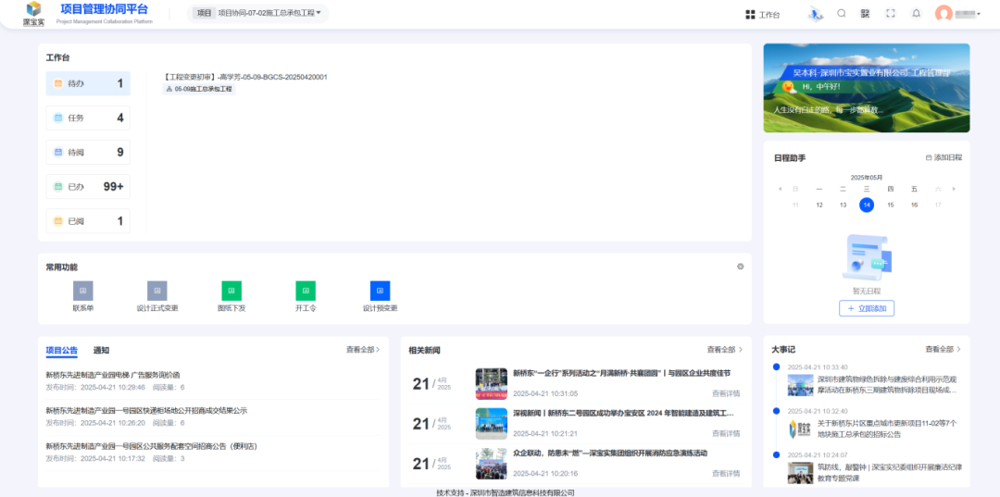

平台服务对象主要包括建设单位工程管理人员，以及施工、监理、设计等参建单位。公开界面能够确认平台设置了项目协同工作台和多类工程业务入口，但用户规模、日活及各单位使用深度尚未公开。

## 二、背景与痛点

新桥东并非单体建筑，而是持续滚动开发的产业园区。其数字化管理难点主要体现在四个方面：

1. **项目与参建主体多**：不同标段由不同施工、监理和设计团队实施，建设单位需要形成统一的业务口径和台账。
2. **工程文件版本频繁变化**：图纸、变更、签证、计量等材料跨组织流转，容易出现版本不一致、信息延迟和责任边界不清。
3. **审批和签章链条长**：线下传递会增加等待、催办和重复录入工作，且难以快速形成完整审计轨迹。
4. **档案容易在竣工阶段集中补录**：业务过程与档案归集脱节，会带来文件缺失、签章不完整、版本错配和移交返工。

因此，平台首先解决的是建设单位侧的流程协同和数据留痕，其次才是与BIM、数字孪生、巡检等技术体系的协同。

## 三、建设目标与范围

### 3.1 核心平台范围

现有公开界面和建设单位材料能够支撑以下五类核心业务：

- 开工管理：在线填报、资料提交和审批流转；
- 图纸管理：图纸上传、查询与业务台账；
- 工程变更：变更事项填报、审批及过程记录；
- 品牌管理：材料或设备品牌信息管理；
- 成本管理：合同清单、验工计价等业务管理。

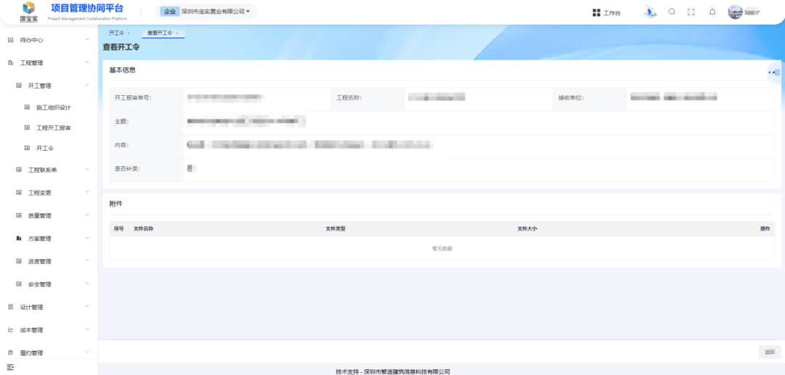

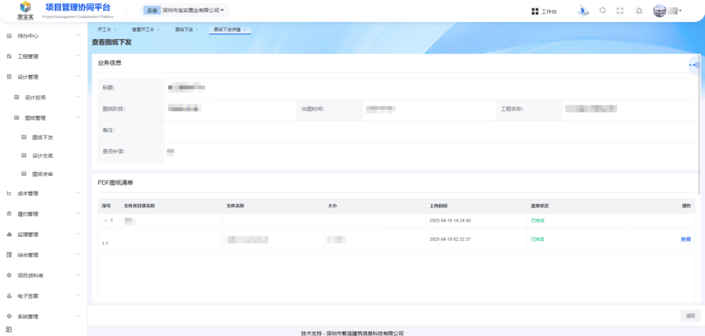

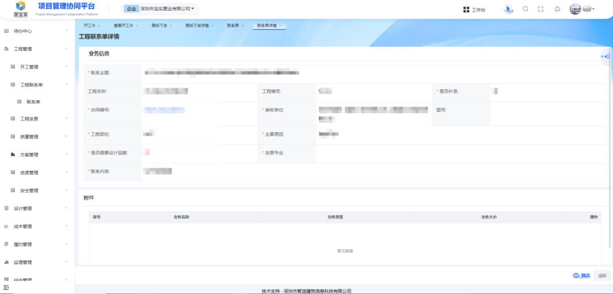

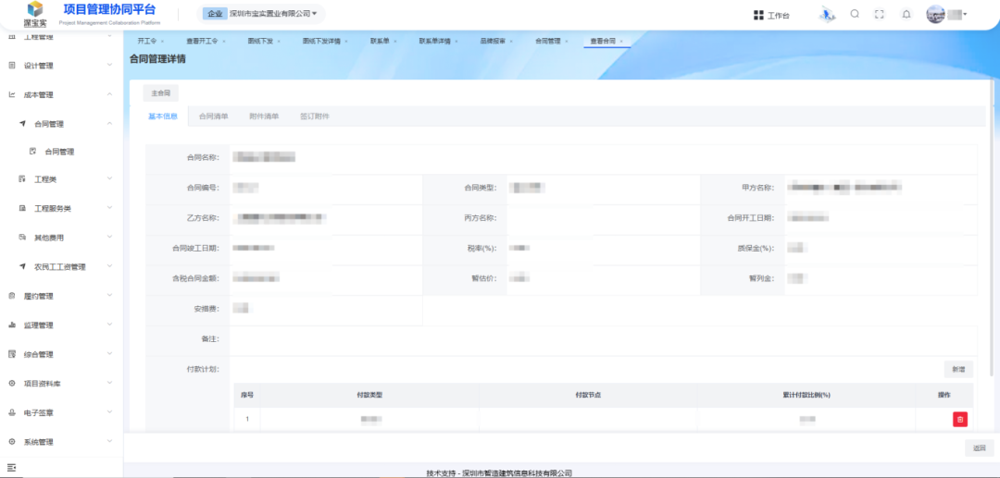

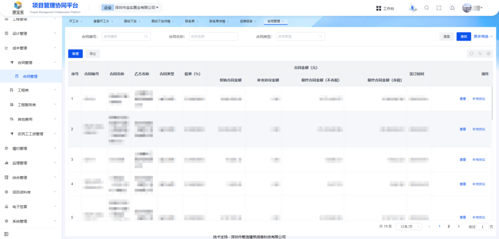

### 3.2 基础支撑能力

公开材料还显示，平台涉及项目组织框架、业务审批、电子签章和电子档案归集等支撑能力。电子档案相关界面能够证明平台已开展案卷目录、文件检测状态及线上业务协同，但“字段级权限”“双因素认证”“自动校验证照有效期”等原案例包中的细节没有足够公开证据，修正版不再作为既成事实表述。

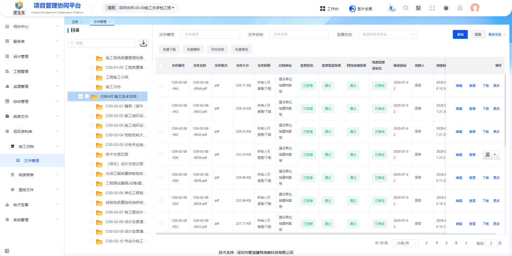

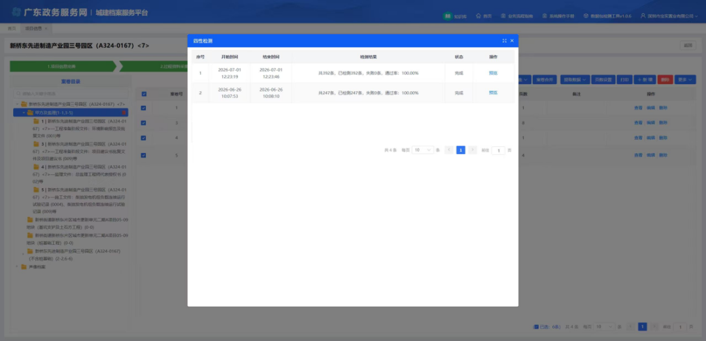

### 3.3 关联应用范围

项目范围内还存在以下关联数字化应用：

- **数字孪生平台**：深圳市国资委2023年公开材料明确提到，平台利用倾斜摄影、BIM等技术管理35个地块，支持规划评审、进度计划统览和招商展示。[S01]
- **新桥东云上巡检系统**：实施单位材料与应用商店信息显示，该系统结合BIM、AR和现场影像开展实模核验与问题记录。[S02][S03][S04]
- **施工单位智能建造与智慧安全应用**：项目观摩材料和施工单位报道展示了无人机、机器人、危大工程台账等应用，但这些能力可能属于具体标段或施工总包自有系统，不应直接计入建设单位协同平台功能。[S08]
- **园区智慧空间与运营系统**：后续智能化工程已公开签约或采购，但其建设时序和系统边界与工程协同平台不同。[S07][S10]

## 四、方案与业务闭环

### 4.1 建设单位侧协同逻辑

平台可被理解为建设单位的工程业务总控入口：参建单位提交业务材料，系统依据项目和组织关系进入审批流程，审批结果形成业务台账，需签章的文件完成电子签署，符合归档范围的文件再进入电子档案目录。

这里可以确认的是“业务线上化、审批留痕和档案归集”的基本方向；公开资料没有披露完整接口清单，因此不能断言所有施工、监理、BIM和财务系统均已实时互联。

### 4.2 工程变更闭环

工程变更是最能体现平台价值的场景。施工或相关责任单位在线发起事项，补充原因、范围和支撑材料；监理、设计、建设单位按职责审核；审批意见、附件和状态在平台中留存；完成后形成可查询的变更台账，并为后续计量计价和档案归集提供依据。

原案例包曾写入“绿色表示按时、红色表示滞后”“自动生成变更方案”等细节，现有截图和公开材料不足以支撑，修正版已删除。

### 4.3 电子档案同步形成

这个案例最值得复制的不是单纯“把纸质资料扫描成电子文件”，而是尝试把档案要求前置到业务过程：审批、签章、变更、验收等业务完成时同步形成可归档文件，减少竣工阶段集中补档。

2026年电子档案试点调研现场照片可以证明相关单位开展了阶段性沟通与展示，但照片本身不能证明“检测通过率100%”或已经完成正式验收，因此修正版仅作为活动证据使用。

### 4.4 BIM、AR与巡检的关联价值

云上巡检系统公开信息表明，其能够通过移动端或全景影像将现场问题与空间位置关联，并开展BIM设计与施工现场的辅助比对。[S02][S03][S04] 这类系统可为质量巡检和问题闭环提供现场证据，但是否与项目管理协同平台实现工单自动回写，当前没有公开接口材料证明。

项目观摩照片能够说明BIM+AR、无人机和机器人等技术曾在项目现场集中展示，不宜据此推断全部设备已在所有园区常态化部署。

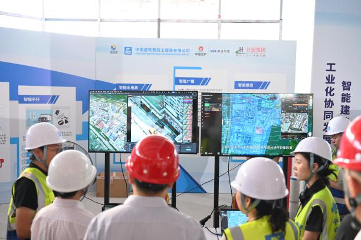

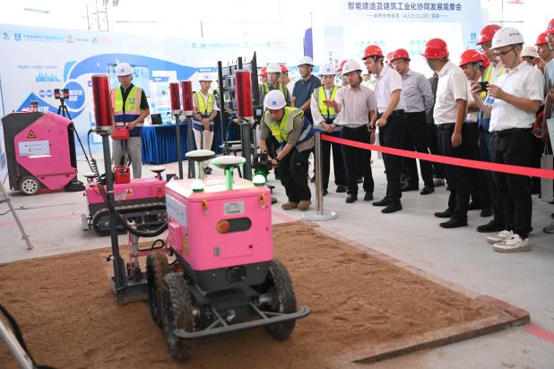

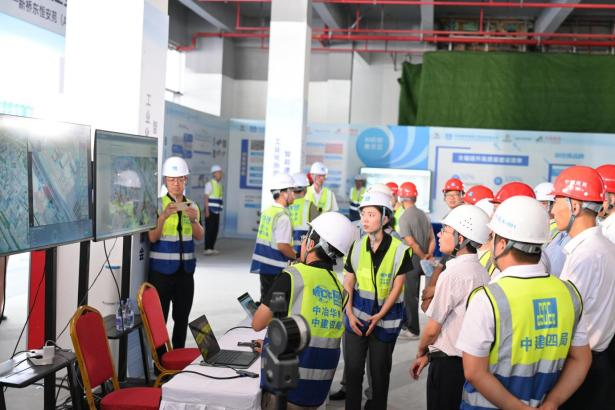

## 五、实施与交付

从公开信息看，新桥东的数字化建设不是一次性交付一个“大而全平台”，而是伴随园区规划、建设和运营分阶段展开：

1. 数字孪生底座较早用于片区规划评审、项目进度与招商展示；[S01]
2. 建设阶段逐步形成项目管理协同平台，并围绕开工、图纸、变更、品牌、成本等业务上线模块；
3. 各标段同步采用无人机、智慧安全、BIM和智能装备等施工数字化手段；[S08]
4. 电子档案能力向“业务同步形成、检测和移交”延伸；
5. 园区交付后再建设智慧空间、能源、安防和运营类系统。[S07][S10]

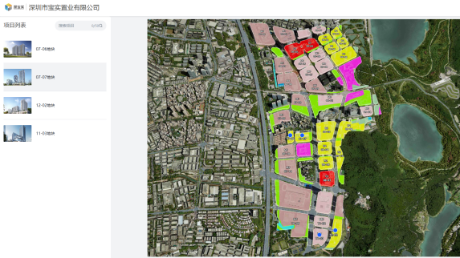

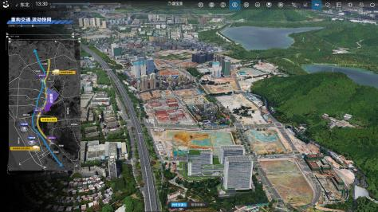

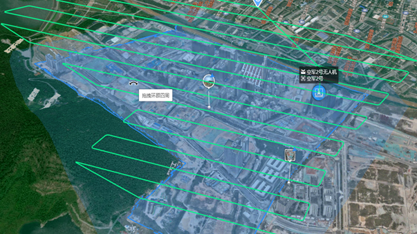

施工单位侧的智慧安全台账具有项目相关性，但它不是建设单位协同平台界面，因此单独作为关联应用示例：

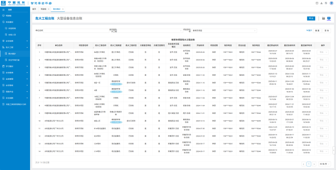

## 六、成效、难点与经验

### 6.1 可以确认的阶段成果

- 项目管理协同平台已有真实登录页、工作台和五类工程业务界面，不是概念方案。
- 数字孪生平台已被深圳市国资委公开报道用于35个地块的规划、项目管理与招商运营。[S01]
- 新桥东云上巡检系统已公开上线，并有独立应用页面和实施单位案例材料支撑。[S02][S03][S04]
- 施工单位已在部分标段应用无人机、BIM和智慧安全等技术。[S08]
- 电子档案已开展试点调研和平台流程展示，但正式验收范围、移交批次和长期运行数据仍需进一步核验。

### 6.2 不宜直接采用的量化宣传

原包中的“档案移交效率提升70%”“电子签章效率提升70%”“数字孪生提升管理效率50%以上”“检测通过率100%”等数据，因缺少原始统计口径、样本范围或第三方评估，本修正版不作为已确认成效。若后续找回建设单位原文，可放入“来源方披露”栏目并标注口径。

### 6.3 主要难点

- 多个平台由不同主体建设，系统边界和接口关系不透明；
- 建设单位平台与施工总包自有系统容易被宣传材料混写；
- 电子签章、原生电子文件和档案移交需要制度、流程与技术共同配合；
- 数字孪生、无人机等展示能力若不能进入业务处置流程，容易停留在可视化层面；
- 平台投资额、用户规模、上线范围和运行绩效尚未公开。

### 6.4 可复制经验

本案例最可复制的做法是以建设单位为流程牵引者，把工程管理规则固化为统一入口，并让业务审批、电子签章和档案归集尽可能同步发生。对西丽高铁新城等多项目群协同场景而言，其价值也在于“项目框架—业务流程—过程文件—档案移交”的连续链条，而不是简单复制某个三维大屏。

## 七、来源与事实边界

完整来源清单见 [`sources/source.md`](sources/source.md)。当前来源能够确认项目背景、数字孪生平台、云上巡检、部分施工数字化应用及后续智慧空间建设；协同平台主体开发单位、平台独立投资额、接口清单、用户规模、AI准确率和正式验收报告仍未公开。

图片分为四类：

- 7张项目管理协同平台实际界面；
- 2张电子档案/签章相关界面；
- 4张项目现场及施工单位关联应用图片；
- 4张片区数字化与调研活动证据图。

所有图片的准确性质、保留理由和限制条件见 [`images.md`](images.md)。
